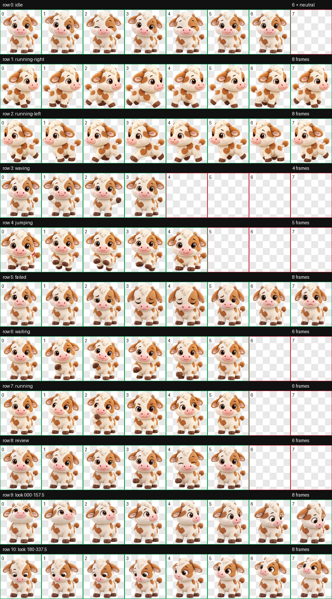

# 可爱牛牛 · Codex Pet

一只软乎乎、圆滚滚、聪明可靠又爱陪伴的小牛牛。

这是一个可安装的 Codex v2 动画宠物，包含：

- 9 组标准动画
- 16 个顺时针视线方向
- 完整透明背景
- 稳定的身体大小、中心与脚底基线
- 不易被裁切的短圆角与收拢耳朵设计



## 安装

将 `niuniu` 文件夹复制到：

```text
~/.codex/pets/niuniu
```

然后在 Codex 的宠物选择器中选择“可爱牛牛”。如果仍显示旧动画，请先切换到其他宠物再切回来，或重启 Codex。

## 文件

```text
niuniu/
├── pet.json
└── spritesheet.webp
```

图集规格：8 列 × 11 行，单格 192 × 208，`spriteVersionNumber: 2`。
